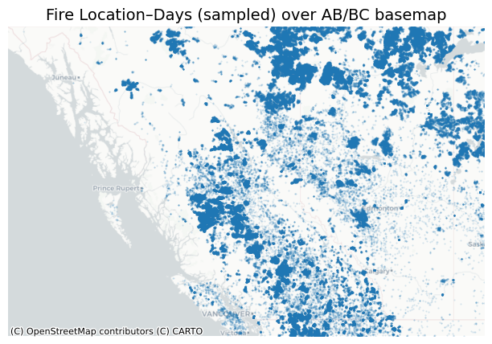
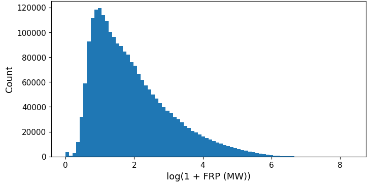
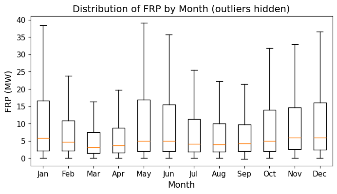
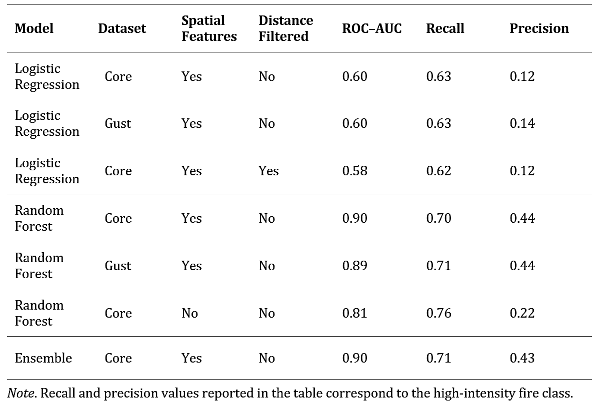

# Classification of Wildfire Intensity in Alberta and British Columbia Using Satellite and Environmental Data
This repository contains the code used for the **data preprocessing, dataset construction, and machine learning modeling** described in the capstone project:

**Classification of Wildfire Intensity in Alberta and British Columbia Using Satellite and Environmental Data**

The project explores the environmental conditions associated with high-intensity wildfire activity in Western Canada by integrating satellite fire detections with meteorological observations and land cover information.

---

## Project Overview
Wildfires are a recurring and intensifying natural hazard in Alberta and British Columbia with significant environmental, economic, and societal impacts. Understanding the environmental conditions associated with high-intensity wildfire activity can support improved wildfire risk assessment and preparedness.

This project integrates multiple environmental datasets to construct machine learning datasets capable of predicting high-intensity wildfire activity.

The analysis combines three primary open-source datasets:

- **VIIRS satellite fire detections**
- **Meteorological station observations**
- **MODIS land cover classifications**

These datasets were integrated using spatial and temporal matching techniques to construct classification-ready datasets.

## Data Integration 
Fire detections were spatially matched with the nearest meteorological station to create unified datasets for modeling.

  
   
  <em>Sampled wildfire detections across Alberta and British Columbia</em>

The resulting datasets capture the spatial distribution of wildfire activity across Western Canada.

## Modeling Approach

The analysis evaluates several machine learning approaches including:
- Logistic regression
- Random forest
- Logistic regression and random forest ensemble modeling

Model performance is evaluated using standard classification metrics including precision, recall, and ROC–AUC, with emphasis placed on predicting **high-intensity fire activity**.

## Exploratory Analysis

Exploratory analysis was conducted to understand the distribution and variability of fire intensity, measured using Fire Radiative Power (FRP).

  
   
  <em>Log-transformed distribution of Fire Radiative Power (FRP)</em>

The distribution of FRP illustrates the behaviour of fire intensity in the study region and highlights the need to identify a threshold to separate low- and high-intensity fire activity.

Additional exploratory analysis was completed to identify temporal trends in FRP observations.

  
   
  <em>Boxplot of Fire Radiative Power (FRP) by Month (outliers removed)</em>

The boxplot highlights seasonal variability in fire intensity, with higher FRP values observed during peak wildfire months.

---

## Repository Structure
- **notebooks/**
  - **preprocessing/**
    – fire data preprocessing and dataset construction
  - **modeling/**
    – machine learning model implementation and evaluation

- **data/**
  - documentation for datasets used in the project

---

### Preprocessing Workflow
The preprocessing notebooks construct the modeling datasets from the original satellite and meteorological observations. 

The preprocessing pipeline includes:
- Fire detection preprocessing and daily aggregation
- Meteorological dataset preparation
- Land cover enrichment using MODIS classifications
- Dataset merging and validation
- Exploratory data analysis and **Fire Radiative Power (FRP) threshold selection**
- Construction of final **model-ready datasets**

---

### Modeling Workflow
The modeling notebooks implement and evaluate several machine learning models used for high-intensity wildfire classification.

The modeling steps include:
- Logistic regression classification models
- Sensitivity analysis based on meteorological station distance
- Random forest classification models
- Spatial sensitivity analysis excluding geographic predictors
- Logistic regression and random forest **ensemble modeling**

---

## Results
The machine learning models demonstrated substantial improvement in predicting high-intensity wildfire activity when incorporating nonlinear modeling approaches and additional environmental features.

A baseline **logistic regression model** achieved moderate performance, with **ROC–AUC ≈ 0.60** and recall of approximately 0.63 for high-intensity fire detection. While this model provided a useful reference point, it was limited in capturing the complexity of the underlying relationships.

To better model these relationships, a **random forest classifier** was implemented. This resulted in a significant improvement in performance, achieving **ROC–AUC ≈ 0.90**. The strong performance of the random forest model indicates that wildfire intensity is influenced by **complex, nonlinear interactions** between meteorological, spatial, and land cover variables.

  
   
  <em>Summary Table of Classification Model Performance</em>

To further explore the contribution of environmental features, an extended dataset incorporating **maximum daily wind gust speed** was developed. Including this variable led to a **small but consistent improvement** in model performance, with a slight increase in precision for high-intensity fire classification. This suggests that wind contributes to wildfire intensity, though its predictive impact is secondary to other factors.

A distance-based sensitivity analysis was also conducted by restricting fire–weather station matching to within 100 km. This constraint did not improve model performance and reduced the available sample size, negatively impacting model stability. These results indicate that broader spatial matching is sufficient for capturing relevant meteorological conditions.

Overall, the results show that **nonlinear models significantly outperform linear approaches**, and that combining geospatial, meteorological, and land cover data provides an effective framework for modeling wildfire intensity.

---

## Data Sources
The datasets used in this project were obtained from publicly available sources.

### VIIRS Fire Detection Data
VIIRS S-NPP 375 m Active Fire Product  
NASA FIRMS / Earthdata

https://earthdata.nasa.gov/

### Meteorological Data
Environment and Climate Change Canada (ECCC)  
MSC Datamart historical climate data

https://www.canada.ca/en/environment-climate-change/services/weather-general-tools-resources/weather-tools-specialized-data.html

### Land Cover Data
MODIS MCD12Q1 Land Cover Type Product (Collection 6.1)  
IGBP land cover classification system

https://doi.org/10.5067/MODIS/MCD12Q1.061

---

## Tools and Libraries
- Python
- Pandas
- NumPy
- Scikit-learn
- Matplotlib
- Jupyter Notebook

---

## Data Availability

Due to file size limitations, the full raw and processed datasets are not included in this repository. The notebooks in `notebooks/preprocessing/` contain the full workflow used to construct the modeling datasets from the original data sources.

---

## Reproducibility

All data preprocessing, integration, and modeling steps described in the project report are implemented in Python using Jupyter notebooks. The repository is organized to reflect the workflow described in the report, allowing the analysis to be reproduced once the datasets are obtained from the sources listed above.

---

## Author

Marika Wood
